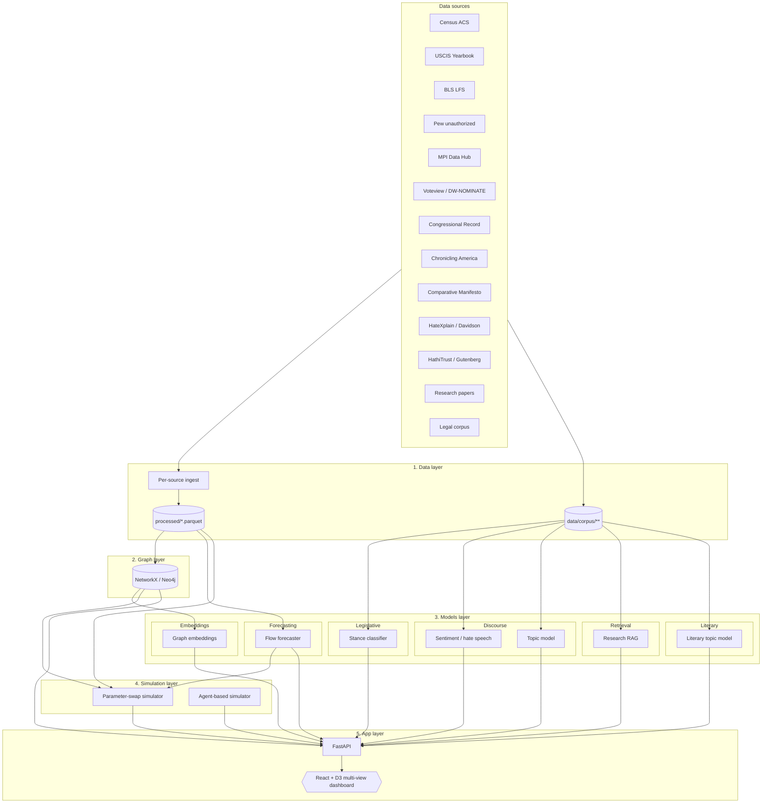

# Architecture

## Project framing

Migration Atlas began as a focused academic case study: a 50-node knowledge graph and four ML models on top of it. The project is now scoping toward an interactive immigration intelligence platform — graph, forecasts, sentiment, discourse, counterfactual simulation, and literary topic modeling under a single dashboard. This document describes the platform architecture as designed, with explicit notes on which parts are built today (Phase A foundation), which are scaffolded but unwired (Phase B/C), and which are planned (Phase D/E).

The original four-layer split (data → graph → models → app) has grown by one layer (simulation) and the model layer has sub-organized by domain. The original layer contracts still hold.

## Five-layer overview

## Layer responsibilities

### 1. Data layer

Ingests from public sources via per-source modules in `migration_atlas.data.sources`. Each module is responsible for one source's network protocol (Census API, BLS API, USCIS XLSX, Pew/MPI manual drops) and emits a typed parquet file in `data/raw/<source>/`.

The `data/process.py` orchestrator harmonizes raw outputs into a small set of canonical processed parquets:

| Output | Schema | Consumed by |
|--------|--------|-------------|
| `foreign_born_by_country.parquet` | year, country, count, moe | Frontend, graph builder |
| `visa_issuance.parquet` | year, country, flow | Forecaster (gold) |
| `flows.parquet` | year, country, flow, method | Forecaster (canonical) |
| `labor_force.parquet` | year, period, series_id, value | Industry views |
| `unauthorized.parquet` | year, country, unauth_pop | Discourse correlation |
| `profiles.parquet` | year, country, metric, value | Detail panel |

Cross-source joins go through `migration_atlas.data.country_codes`, which is the single source of truth for canonical country ids, ISO 3166-1 alpha-3 codes, and source-specific labels.

Phase A discourse / literary additions land in the same layer:

| Source | Module | Output |
|--------|--------|--------|
| Voteview | `data/sources/voteview.py` (Phase B) | `legislators.parquet` (member_id, party, dw_nominate, term_years) |
| Comparative Manifesto | `data/sources/manifesto.py` (Phase B) | `party_platforms.parquet` (party, year, immigration_position_text) |
| Chronicling America | `data/sources/historical_press.py` (Phase B) | corpus chunks under `data/corpus/historical_press/` |
| HateXplain / Davidson / Founta | `data/sources/hate_speech.py` (Phase B) | `discourse_labels.parquet` |
| HathiTrust / Gutenberg | `data/sources/literature.py` (Phase D) | corpus chunks under `data/corpus/literature/` |

### 2. Graph layer

Stores harmonized data as a typed knowledge graph. The default backend is in-memory NetworkX; production deployments use Neo4j via the shared `GraphBackend` Protocol. The schema lives in `migration_atlas.graph.schema`.

Phase A schema (built today):

- Node kinds: `country`, `visa`, `law`, `industry`, `region`
- Edge kinds: `uses-visa`, `enables`, `restricts`, `creates`, `legalized`, `works-in`, `settles-in`, `amends`

Phase B schema additions (planned):

- Node kinds: `party-platform`, `legislator`, `news-org`, `discourse-event`
- Edge kinds: `said-by`, `affiliated-with`, `targets`, `responds-to`

Phase D schema additions (planned):

- Node kinds: `author`, `book`
- Edge kinds: `depicts`, `set-in-era`, `narrates-from`

Each node kind has a Pydantic `XProperties` model in `schema.py` that defines its validated property bag. New kinds extend the schema; downstream code does not introduce new kinds ad hoc.

### 3. Models layer

Six model domains, each in its own subpackage under `migration_atlas.models`. The current flat layout will reorganize as Phase B and D models are added; the table below shows the target structure.

| Domain | Model | Current location | Status |
|--------|-------|------------------|--------|
| Legislative | Stance classifier | `models/stance_classifier.py` | Built (Phase 1), needs labels |
| Forecasting | Flow forecaster | `models/forecaster.py` | Built, needs real flows |
| Embeddings | Graph embeddings | `models/graph_embeddings.py` | Built |
| Retrieval | Research-paper RAG | `models/rag.py` | Built, needs corpus |
| Discourse | Sentiment / hate speech | `models/discourse/sentiment.py` | Phase B |
| Discourse | Topic model | `models/discourse/topic.py` | Phase B |
| Literary | Literary topic model | `models/literary/topic.py` | Phase D |

The hard contract: the models layer does not assume a specific graph backend (everything goes through `migration_atlas.graph`) and does not reach into the data layer's raw outputs (everything reads from `data/processed/` or `data/corpus/`).

### 4. Simulation layer (new)

The simulation layer is the Phase C addition. Two engines, in increasing order of fidelity and effort:

**Parameter-swap simulator** (`migration_atlas.sim.param_swap`). The cheap version. Re-runs the historical flow series with origin-country parameters substituted (e.g., apply Italian-1900–1924 fertility and emigration intensity to a different period). Produces evocative counterfactuals labeled clearly as such; outputs include a "real" series and a "swap" series for visual comparison. Not predictive in the causal-inference sense.

**Agent-based simulator** (`migration_atlas.sim.agents`). The expensive version. Each origin-year cohort is modeled as a population of agents with migration utility functions; policy nodes in the graph (visa caps, family-based preferences, refugee admissions) act as gates. Calibrated to reproduce historical flows on a held-out window before being used for counterfactual exploration. Phase C2; Phase C1 ships parameter-swap only.

Both engines write outputs to `data/simulations/<run_id>/` with metadata so the API can replay them without re-running.

### 5. App layer

A FastAPI backend exposes the system through a small set of typed endpoints. The frontend is no longer one graph view; it is a multi-view dashboard with named routes.

API endpoints:

| Endpoint | Domain | Status |
|----------|--------|--------|
| `GET /health` | Liveness | Built |
| `GET /graph` | Graph data | Built |
| `POST /query` | Unified NL router | Built |
| `GET /forecast/{country}` | Forecaster | Built |
| `GET /similar/{node_id}` | Embeddings | Built |
| `POST /sentiment` | Discourse | Phase B |
| `POST /simulate` | Counterfactual sim | Phase C |
| `GET /literature/topics` | Literary topic model | Phase D |
| `GET /sources` | Per-source manifest | Phase A |

Frontend views (Phase E):

| View | Purpose | Visualization |
|------|---------|---------------|
| Atlas | The current graph view | Force-directed graph (D3) |
| Forecast | Flow projections | Time-series with prediction intervals |
| Discourse | Sentiment over time | Choropleth + Sankey (sentiment by year × group) |
| Simulate | Counterfactual exploration | Side-by-side time-series, parameter sliders |
| Library | Literary topic model | Topic-stream + book-detail drawer |
| Timeline | Synchronized history | Stacked timeline (laws + flows + discourse + literature) |

The frontend is a single SPA with a router (TanStack Router or React Router); each view loads independently and can be linked-to with URL state.

## Layer contracts (these are firm)

- The data layer never imports from the model, simulation, or app layers.
- The graph layer never imports from the model, simulation, or app layers.
- The model layer goes through `migration_atlas.graph` for graph access and `data/processed/` or `data/corpus/` for data access; it never assumes a specific graph backend.
- The simulation layer reads from the graph and from processed parquets; it produces outputs that the app layer serves but does not control the app layer's presentation.
- The app layer exposes typed endpoints; the frontend uses only those endpoints.
- Each model and simulator is independently runnable via its own Typer CLI.

These contracts are the same as the original four-layer architecture; the simulation layer slots in between models and app and inherits the same boundary discipline.

## Data stores

| Store | What | Where | Status |
|-------|------|-------|--------|
| Parquet | Tabular ETL outputs | `data/processed/*.parquet` | Built |
| ChromaDB | RAG vector index | `chroma_db/` | Built |
| NetworkX | Default graph backend | In-memory | Built |
| Neo4j | Optional graph backend | Configured by `graph_backend` setting | Built (optional) |
| Files + HF Hub | Model checkpoints | `checkpoints/` (gitignored), HuggingFace Hub | Built |
| Parquet | Simulation runs | `data/simulations/<run_id>/` | Phase C |
| Parquet | Discourse labels | `data/processed/discourse_labels.parquet` | Phase B |

No PostgreSQL, no MongoDB, no Redis, no Elasticsearch. The platform's storage needs do not exceed what parquet, ChromaDB, and an optional Neo4j cover. If Phase E surfaces a real-time-data requirement that those don't meet (e.g., user accounts and saved simulations across sessions), a single managed Postgres can be added; until then, the storage stack is intentionally minimal.

## Phase roadmap

| Phase | Scope | Status |
|-------|-------|--------|
| **A. Foundation** | Schema, seed graph, four base models, scaffold, CI, docs | ✅ Built |
| **A.5. Real data** | Census ACS, USCIS, BLS, Pew, MPI ingest; harmonization; real flows | ✅ Code in place; needs API key + run |
| **B. Discourse** | Voteview, Manifesto, Chronicling America, hate-speech corpora; sentiment/topic models; `/sentiment` endpoint | 🚧 In progress: ingest modules + sentiment classifier + `/sentiment` shipped; topic model pending |
| **C. Simulation** | Parameter-swap simulator; `/simulate` endpoint; counterfactual UI | ⏳ Planned |
| **D. Literary** | HathiTrust/Gutenberg ingest; literary topic model; library UI | ⏳ Planned |
| **E. Visualization overhaul** | Multi-view dashboard, Sankey, choropleth, synced timeline, simulation controls | ⏳ Planned |

Each phase unlocks data the next consumes; A.5 and E can overlap, but B/C/D each need A.5 finished first.

## Why this split (revisited)

The boundary between layers is a hard contract. The original four-layer architecture documented why this discipline matters for a portfolio project; the same reasoning holds at platform scale. Every additional model domain that gets bolted on without respecting the contract is a future maintenance debt. The simulation layer's introduction was the first real test of whether the original boundaries hold up, and they did: it slots in between the model and app layers without modifying either.

## What this architecture does not yet describe

- **Authentication and saved sessions.** If users will save simulations or annotations, a session store is needed; this is out of scope until Phase E surfaces a use case.
- **Streaming / real-time updates.** The current architecture is batch end-to-end. If a future phase wants live news/discourse ingestion, a queue (Redis Streams, NATS) will need to be added at the data layer's ingest boundary.
- **Multi-tenancy.** The platform is single-tenant. Multi-tenancy is out of scope for the academic / portfolio framing.
- **Mobile-native frontend.** The frontend is a desktop-first SPA. A mobile experience is out of scope for the visualization overhaul.

These are honest gaps, recorded here so future work knows where the boundaries are.
