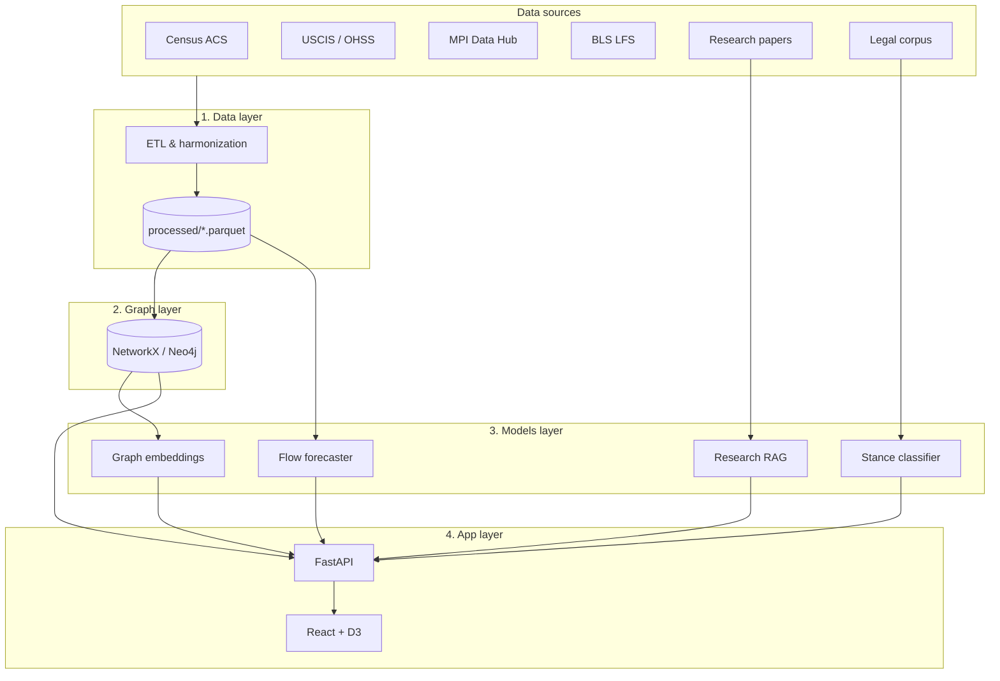

# Architecture

Migration Atlas is composed of four logical layers, each independently swappable.

## High-level

## Layer responsibilities

### 1. Data layer
Ingests from public sources (Census ACS, USCIS, MPI, BLS, OECD) and a curated legal corpus. Harmonizes country names, year vintages, and definitional differences. Outputs are Parquet files in `data/processed/`.

### 2. Graph layer
Stores the harmonized data as a typed knowledge graph. Default is in-memory NetworkX; production deployments use Neo4j with the Graph Data Science library. The schema is defined in `migration_atlas.graph.schema`.

### 3. Models layer
Four models run on top of the graph and corpus:

- **Stance classifier** — fine-tuned DistilBERT scoring legal text on four axes
- **Research RAG** — sentence-transformers + ChromaDB for evidence retrieval
- **Flow forecaster** — Prophet + LSTM ensemble
- **Graph embeddings** — Node2Vec for similarity and link prediction

### 4. App layer
A FastAPI backend exposes the models through a unified `/query` endpoint. The frontend is a React + D3 single-page app that visualizes the knowledge graph and surfaces model outputs inline.

## Why this split

The boundary between layers is a hard contract. The data layer never imports from the model layer; the model layer never assumes a specific graph backend; the app layer never reaches into the model internals. This means each layer can be tested, replaced, or scaled independently — important for a portfolio project that should look like real engineering, not a notebook.
